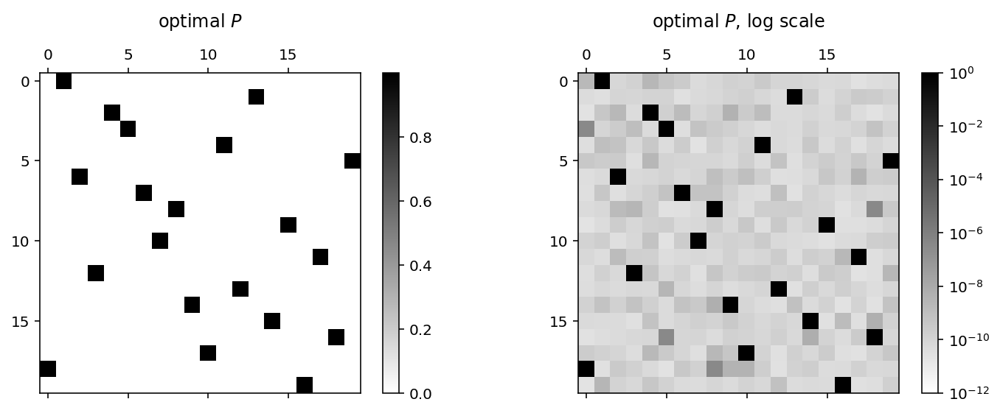

# Last Man Standing

-- [Danial Dervovic](https://ddervs.github.io)

A good friend of mine with a penchant for sports betting told me recently about a new game he's been playing: [Last Man Standing](https://organise.runlastman.com/how-to-play-premiership/). In this blog post we're going to develop strategies for playing this game. Let's get to it.

**The Rules.**

- The game starts at the beginning of the English Premier League (EPL) season (or other sports league of your choice).
- There are $M$ players in the game. Each player puts in $x$ units of cash (say, twenty quid).
- Each of the $M$ players chooses one of the $n$ teams in the league. Different players can choose the same team if they wish.
- If a given player's team wins, they go through to the next week; lose or draw, they're out.
- The remaining players choose another team that they think will win. Importantly, *no player can choose a team they have chosen before*.
- This procedure continues until either: there is one player left and they take all the winnings; or, there are no players left and another game begins, starting the next week. The pot rolls over, everyone puts in $x$ monies again and they are each free to choose any team they like again.
- Continue until everyone is broke, apart from the player with the best strategy! Hopefully this will be us by the end of this blog post 😉.

The moment my pal told me about this I was hooked. This seemed exactly like the kind of game amenable to some mathematical and algorithmic analysis -- potentially giving the informed player an edge over their unwitting opponents. What follows is my winding path of thoughts and strategies on how to play this game.

## Formalised model

The first thing to do when thinking about this was to create a mathematical model of the game. 

First, we have $n$ teams. We impose a linear ordering of the teams, i.e., the $1$st team is Arsenal, the $2$nd team is Chelsea etc -- we will refer to a team simply by its index $j \in [n]$ (where $n:=\{1,2,\ldots, n\}$). Naturally, a *strategy* is then defined as ordered list of integers from $[n]$, with no repeats. Optimistically, we hope we won't lose at any round so we specify a strategy as the longest possible list. The resulting list is a [*permutation*](https://en.wikipedia.org/wiki/Permutation), $\sigma \in \mathbb{S}_n$, where $\mathbb{S}_n$ is the symmetric group on $n$ elements.

Note an individual season will require two consecutive strategies in the best case, as each team plays home and away (concretely, in the EPL each pair of teams plays a match against each other twice per season). Without loss of generality we can consider the single best strategy from any chosen starting point in the season. When we must start again (i.e. when all our choices win, or more likely, one loses and we start playing again), recalculate the best strategy from the new starting point. 

-----

Now we have a formal notion for a strategy (as a permutation $\sigma \in \mathbb{S}_n$) we need to specify how to evaluate the various strategies. Note that the number of possible strategies is large ($n! \sim 10^{18}$ for the EPL). Let's take the most natural measure: how likely is it that a strategy wins? Namely,

$$\operatorname{VAL}(\sigma) := \mathbb{P}(\sigma \text{ wins} ) = \mathbb{P}( \omega^{(1)}_{\sigma(1)} \cap \omega^{(2)}_{\sigma(2)} \cap \cdots \cap \omega^{(n)}_{\sigma(n)} ),$$

where $\omega^{(i)}_{j}$ is the event that team $j$ wins in week $i$ and we define $\operatorname{VAL}(\sigma)$ as the *value* of a strategy $\sigma \in \mathbb{S}_n$. Of course, the best strategy $\sigma^\star$ is the one with highest probability of winning, i.e. $\sigma^\star := \arg \max_{\sigma \in \mathbb{S}_n} \operatorname{VAL}(\sigma)$.


Now we run into our first problem: how to evaluate $\operatorname{VAL}(\sigma)$. This involves computing $\mathbb{P}(\sigma \text{ wins} )$. Now we don't even know if this probability is well defined, different probabilistic models will return different values. Moreover, there are $n!$ strategies, so evaluating each strategy separately will be intractable. We *need* a simplifying assumption. First, let's introduce some notation:
$$p^{(i)}_j = \mathbb{P} \left( \text{team }j\text{ wins in week }i \right) = \mathbb{P}(\omega^{(i)}_j).$$
We're going to make the following assumption:

**Assumption 1.** *The winning probabilities $p^{(i)}_j$ are independent, for all $i,j\in [n]$.*

This assumption clearly doesn't hold in reality. Consider the following scenario: team $j$ plays team $j'$ in week $i$. Then $p^{(i)}_j + p^{(i)}_{j'} \leq 1$ since both teams can't win at the same time! One could consider numerous other scenarios in which this model fails, for instance think about a 'winning streak' -- teams that have in previous weeks are likely to keep winning, due to some underlying factor such as a new great manager etc. 

Nevertheless, we are going to work within the independence model as it will make the winning probabilities tractable. We are going to approximate $\operatorname{VAL}(\sigma)$ in the following way:

$$ \widetilde{\operatorname{VAL}}(\sigma) = \prod_{i \in [n]} p^{(i)}_{\sigma(i)},$$

i.e. using the product of the winning probabilities, which is just the joint winning probability $\mathbb{P}(\sigma \text{ wins})$ for the teams ordered according to the strategy $\sigma$, under the independence assumption (Assumption 1).

We can now formally define the Last Man Standing problem $(\mathsf{LMS})$.

**Problem ($\mathsf{LMS}$).** Let $p^{(i)}_j \in (0, 1)$ for $i,j \in [n]$. Then, find
$$\tag{$\mathsf{LMS}$} \widetilde{\sigma}^\star = \arg \max_{\sigma \in \mathbb{S_n}}\widetilde{\operatorname{VAL}}(\sigma).  $$

*Note.* The domain of the $p^{(i)}_j$ is the open interval $(0,1)$ as opposed to the closed interval $[0,1]$ since a team is never 100% likely to win or lose.

## Implementation

Great, we now have a concrete mathematical problem we would like to solve, but it would be good to apply to some concrete data. Namely, where do we get the winning probabilities $p^{(i)}_j$? I thought about this for a while and came to the conclusion that no one is going to be better at calculating the chances of different of outcomes of sports games than bookmakers. Duh! Now we just need bookies' odds data from somewhere...

Fortunately, the excellent `footballdata` python package gives us everything we need in a nice `pandas` DataFrame format. Let's explore a little bit.


```python
%matplotlib inline
%config InlineBackend.figure_format = 'retina'

import footballdata as foo
import matplotlib.pyplot as plt
import numpy as np
np.random.seed(1234)
import pandas as pd
import itertools
import cvxpy as cvx

from matplotlib.pyplot import figure, show
import pprint as pp
```


```python
print(foo.MatchHistory.__doc__)
```

    Provides pandas.DataFrames from CSV files available at
        http://www.football-data.co.uk/data.php
    
        Column names are explained here: http://www.football-data.co.uk/notes.txt
    
        Data will be downloaded as necessary and cached locally in ./data
    
        Parameters
        ----------
        leagues : string or iterable of league-ids to include, None for all
        seasons : string, int or list of seasons. Examples:
                  '16-17'; 2016; '2016-17'; [14, 15, 16]
        


```python
foo.MatchHistory.available_leagues()
```


    ['BEL-Jupiler League',
     'ENG-Championship',
     'ENG-Conference',
     'ENG-League 1',
     'ENG-League 2',
     'ENG-Premier League',
     'ESP-La Liga',
     'ESP-La Liga 2',
     'FRA-Ligue 1',
     'FRA-Ligue 2',
     'GER-Bundesliga',
     'GER-Bundesliga 2',
     'GRE-Ethniki Katigoria',
     'ITA-Serie A',
     'ITA-Serie B',
     'NED-Eredivisie',
     'POR-Liga 1',
     'SCO-Division 1',
     'SCO-Division 2',
     'SCO-Division 3',
     'SCO-Premiership',
     'TUR-Ligi 1']


```python
prem = foo.MatchHistory('ENG-Premier League', range(2016, 2017)).read_games()
prem.sample(5)
```


<div>
<style>
    .dataframe thead tr:only-child th {
        text-align: right;
    }

    .dataframe thead th {
        text-align: left;
    }

    .dataframe tbody tr th {
        vertical-align: top;
    }
</style>
<table border="1" class="dataframe">
  <thead>
    <tr style="text-align: right;">
      <th></th>
      <th></th>
      <th></th>
      <th>date</th>
      <th>home_team</th>
      <th>away_team</th>
      <th>FTHG</th>
      <th>FTAG</th>
      <th>FTR</th>
      <th>HTHG</th>
      <th>HTAG</th>
      <th>HTR</th>
      <th>Referee</th>
      <th>...</th>
      <th>BbAv&lt;2.5</th>
      <th>BbAH</th>
      <th>BbAHh</th>
      <th>BbMxAHH</th>
      <th>BbAvAHH</th>
      <th>BbMxAHA</th>
      <th>BbAvAHA</th>
      <th>PSCH</th>
      <th>PSCD</th>
      <th>PSCA</th>
    </tr>
    <tr>
      <th>league</th>
      <th>season</th>
      <th>game_id</th>
      <th></th>
      <th></th>
      <th></th>
      <th></th>
      <th></th>
      <th></th>
      <th></th>
      <th></th>
      <th></th>
      <th></th>
      <th></th>
      <th></th>
      <th></th>
      <th></th>
      <th></th>
      <th></th>
      <th></th>
      <th></th>
      <th></th>
      <th></th>
      <th></th>
    </tr>
  </thead>
  <tbody>
    <tr>
      <th rowspan="5" valign="top">ENG-Premier League</th>
      <th rowspan="5" valign="top">1617</th>
      <th>2017-05-12 West Bromwich Albion-Chelsea</th>
      <td>2017-05-12</td>
      <td>West Bromwich Albion</td>
      <td>Chelsea</td>
      <td>0</td>
      <td>1</td>
      <td>A</td>
      <td>0</td>
      <td>0</td>
      <td>D</td>
      <td>M Oliver</td>
      <td>...</td>
      <td>1.99</td>
      <td>20</td>
      <td>1.25</td>
      <td>2.06</td>
      <td>2.02</td>
      <td>1.89</td>
      <td>1.85</td>
      <td>9.76</td>
      <td>5.18</td>
      <td>1.38</td>
    </tr>
    <tr>
      <th>2017-04-15 Tottenham Hotspur-AFC Bournemouth</th>
      <td>2017-04-15</td>
      <td>Tottenham Hotspur</td>
      <td>AFC Bournemouth</td>
      <td>4</td>
      <td>0</td>
      <td>H</td>
      <td>2</td>
      <td>0</td>
      <td>H</td>
      <td>M Oliver</td>
      <td>...</td>
      <td>2.80</td>
      <td>21</td>
      <td>-1.75</td>
      <td>1.98</td>
      <td>1.92</td>
      <td>2.01</td>
      <td>1.95</td>
      <td>1.25</td>
      <td>7.00</td>
      <td>12.80</td>
    </tr>
    <tr>
      <th>2017-04-30 Manchester United-Swansea City</th>
      <td>2017-04-30</td>
      <td>Manchester United</td>
      <td>Swansea City</td>
      <td>1</td>
      <td>1</td>
      <td>D</td>
      <td>1</td>
      <td>0</td>
      <td>H</td>
      <td>N Swarbrick</td>
      <td>...</td>
      <td>2.03</td>
      <td>21</td>
      <td>-1.50</td>
      <td>2.21</td>
      <td>2.14</td>
      <td>1.78</td>
      <td>1.74</td>
      <td>1.42</td>
      <td>4.79</td>
      <td>9.45</td>
    </tr>
    <tr>
      <th>2016-10-29 Manchester United-Burnley</th>
      <td>2016-10-29</td>
      <td>Manchester United</td>
      <td>Burnley</td>
      <td>0</td>
      <td>0</td>
      <td>D</td>
      <td>0</td>
      <td>0</td>
      <td>D</td>
      <td>M Clattenburg</td>
      <td>...</td>
      <td>2.12</td>
      <td>36</td>
      <td>-2.00</td>
      <td>2.13</td>
      <td>2.05</td>
      <td>1.85</td>
      <td>1.80</td>
      <td>1.26</td>
      <td>6.40</td>
      <td>14.25</td>
    </tr>
    <tr>
      <th>2017-05-21 Leicester City-AFC Bournemouth</th>
      <td>2017-05-21</td>
      <td>Leicester City</td>
      <td>AFC Bournemouth</td>
      <td>1</td>
      <td>1</td>
      <td>D</td>
      <td>0</td>
      <td>1</td>
      <td>A</td>
      <td>l Mason</td>
      <td>...</td>
      <td>2.23</td>
      <td>17</td>
      <td>-0.50</td>
      <td>1.95</td>
      <td>1.89</td>
      <td>2.03</td>
      <td>1.98</td>
      <td>1.69</td>
      <td>4.50</td>
      <td>4.81</td>
    </tr>
  </tbody>
</table>
<p>5 rows × 64 columns</p>
</div>


```python
print(list(prem)) # columns of DataFrame
```

    ['date', 'home_team', 'away_team', 'FTHG', 'FTAG', 'FTR', 'HTHG', 'HTAG', 'HTR', 'Referee', 'HS', 'AS', 'HST', 'AST', 'HF', 'AF', 'HC', 'AC', 'HY', 'AY', 'HR', 'AR', 'B365H', 'B365D', 'B365A', 'BWH', 'BWD', 'BWA', 'IWH', 'IWD', 'IWA', 'LBH', 'LBD', 'LBA', 'PSH', 'PSD', 'PSA', 'WHH', 'WHD', 'WHA', 'VCH', 'VCD', 'VCA', 'Bb1X2', 'BbMxH', 'BbAvH', 'BbMxD', 'BbAvD', 'BbMxA', 'BbAvA', 'BbOU', 'BbMx>2.5', 'BbAv>2.5', 'BbMx<2.5', 'BbAv<2.5', 'BbAH', 'BbAHh', 'BbMxAHH', 'BbAvAHH', 'BbMxAHA', 'BbAvAHA', 'PSCH', 'PSCD', 'PSCA']


We can see for the 2016-2017 premiership season we have a variety of bookies we can go to -- these are the fields ending in 'H', 'D' and 'A'; corresponding to 'home win', 'draw' and 'away win' respectively. Here we are given the odds in European format. We will need to convert these odds into a probability.

### Computing probabilities from odds

European odds are given as a decimal number equalling `bookies_payout/betters_stake`. As an example, European odds of 1.40 mean that if you stake £100, the bet (if successful) will payout £140, and your profit will be £40.

Odds don't correspond directly with the probabilities, since the bookies need their cut for whichever outcome takes place! We assume that the bookies' cut, or *vig* is factored in proportionally with the odds. The bookmaker prices the decimal odds $d_E$ for an event $E$ as 

$$d_E = \frac{1}{p_E + o_E},$$

where $p_E$ is their estimated probability for $E$ and $o_E$ is the overround for $E$. The overround is the relative form of the vig, i.e. the vig is the bookmaker's percentage profit on the total stakes made on the event, whereas the overround is the expected profit. For example, 20% overround is vigorish of 16 2/3%

We have $o_E = o$ for all $E \in \Omega$, where $\Omega$ is the event set, since we assume the vig is priced proportionally to the odds. 

We can then solve for the probabilities like so:

$$\frac{1}{d_E}= p_E + o_E = p_E + o$$

and 

$$\sum_{E' \in \Omega} \frac{1}{d_{E'}} = 1 + \sum_{E' \in \Omega}{o_{E'}} = 1 + |\Omega|o.$$

So, $o = \frac{1}{|\Omega|}\left( \sum_{E' \in \Omega} \frac{1}{d_{E'}} - 1 \right)$ and we have

$$p_E = \frac{1}{d_E} -  \frac{1}{|\Omega|} \left(\sum_{E' \in \Omega} \frac{1}{d_{E'}} - 1 \right) = \frac{1}{|\Omega|} + \frac{1}{d_E} - \frac{1}{|\Omega|}\sum_{E' \in \Omega} \frac{1}{d_{E'}}.$$


```python
def probs_from_odds(odds_home, odds_draw, odds_away):
    sum_reciprocol_odds = 1 / odds_home + 1 / odds_draw + 1 / odds_away
    summand = - (1 / 3) * sum_reciprocol_odds + (1 / 3)
    prob_home, prob_draw, prob_away = \
        map(lambda odds: 1 / odds +  summand, [odds_home, odds_draw, odds_away])
    return prob_home, prob_draw, prob_away
```

### Team names

Below we number the teams, i.e. establish the correspondence $\text{team name} \mapsto j \in [n]$.


```python
teams = list(prem.home_team.unique())
print(teams)
```

    ['Burnley', 'Crystal Palace', 'Everton', 'Hull City', 'Manchester City', 'Middlesbrough', 'Southampton', 'AFC Bournemouth', 'Arsenal', 'Chelsea', 'Manchester United', 'Leicester City', 'Stoke City', 'Swansea City', 'Tottenham Hotspur', 'Watford', 'West Bromwich Albion', 'Sunderland', 'West Ham United', 'Liverpool']


## Winning probabilities matrix

What we want now is the matrix $X\in [0,1]^{38 \times 20}$, with elements defined by

$$X_{i,j} := p^{(i)}_j = \text{probability that team }j\text{ wins in week }i.$$


```python
def build_X(league, teams, bookie_name)
    num_teams = len(teams)
    X = np.zeros( (2 * (num_teams - 1), num_teams))
    X_index = np.empty((2 * (num_teams - 1), num_teams), dtype=object)
    games_played_by_team = np.zeros(len(teams), dtype=int) # array keeps track of how many games each team has played

    for index, row in league.iterrows():
        j_home = teams.index(row["home_team"])
        j_away = teams.index(row["away_team"])
        i_home = games_played_by_team[j_home]
        i_away = games_played_by_team[j_away]
        home_prob, draw_prob, away_prob = probs_from_odds(row[bookie_name + "H"], row[bookie_name + "D"], row[bookie_name + "A"])
        X[i_home, j_home] = home_prob
        X[i_away, j_away] = away_prob
        X_index[i_home, j_home] = index
        X_index[i_away, j_away] = index
        games_played_by_team[j_home] += 1
        games_played_by_team[j_away] += 1
    return X    
```


```python
X = build_X(prem, teams, "B365")
```

### Practical concerns

The winning probabilities will be (very) small, even for the best ones. So let's use the $\log(\widetilde{\text{VAL}})$ of the winning probability as our metric of 'goodness' for a strategy, since $\log(x)$ is a monotonic function of $x \in (0, 1]$. 

We also want to be able to convert a permutation back into a list of teams


```python
def evaluate_perm(perm_list, X):
    """
      Gives log of winning probability of a permutation
    """
    winning_probs = X[np.arange(len(perm_list)), np.array(perm_list)]
    return np.sum(np.log(winning_probs))
```


```python
def team_order_from_perm_list(perm_list, teams):
    """
        takes a list of integers and returns corresponding list of teams
    """
    ## check list 'full'
    if( not (sorted(perm_list) == list(range(len(perm_list))))):
        raise(ValueError("perm_list doesn't contain all integers from 0 to %d" % (len(perm_list) -1 )))
    team_choice = [teams[i] for i in perm_list]
    return team_choice
```

# Strategies

We now have all the necessary ingredients to start deriving and evaluating strategies.

## Greedy strategy

First of all, let's do the most simple thing we can do: at each time, pick the team out of those you are allowed to with the highest winning probability for that week. We'll call this the *greedy strategy*.


```python
def greedy_strategy(X, teams):
    """
        Given winning probability matrix X returns the "greedy" strategy
        permutation of teams - given as a list of integers.
    """
    ## Check dims of X ok
    num_weeks = X.shape[0]
    num_teams = X.shape[1]
    if (num_teams != len(teams)):
        raise(ValueError("X needs to have %d rows, has %d." % (num_teams, X.shape[1])))
    # generate sample
    visited = []
    for t in list(range(min(num_teams, num_weeks))):
        allowed = [i for i in list(range(num_teams)) if i not in visited]
        probs = X[t, allowed] / np.sum(X[t, allowed])
        sample = allowed[np.argmax(probs)]
        visited.append(sample)
    return visited
```


```python
greedy_perm = greedy_strategy(X, teams)
greedy_strategy_result = {"opt_perm": greedy_perm, \
                          "opt_value": evaluate_perm(greedy_perm, X), \
                          "opt_team_list": team_order_from_perm_list(greedy_perm, teams)\
                         }
pp.pprint(greedy_strategy_result, compact=True)
```

    {'opt_perm': [4, 14, 9, 8, 11, 19, 10, 6, 18, 15, 7, 2, 16, 12, 13, 1, 5, 0, 17,
                  3],
     'opt_team_list': ['Manchester City', 'Tottenham Hotspur', 'Chelsea', 'Arsenal',
                       'Leicester City', 'Liverpool', 'Manchester United',
                       'Southampton', 'West Ham United', 'Watford',
                       'AFC Bournemouth', 'Everton', 'West Bromwich Albion',
                       'Stoke City', 'Swansea City', 'Crystal Palace',
                       'Middlesbrough', 'Burnley', 'Sunderland', 'Hull City'],
     'opt_value': -13.507040869365095}


So by our earlier reasoning, any permutation of teams we can find that is higher than `greedy_strategy_result["opt_value"]` is a success!

## Greedy sampling strategy

Now let's do the second simplest thing we can think of.

**Greedy sampling (GS). ** At each timestep $t$, look at the teams that haven't previously been chosen. Choose a team randomly, where the probability is proportional to the odds of that team winning in week $t$.

More formally, let $\mathcal{A}(t)$ be the set of teams allowed at time $t$, i.e. those that have not been chosen in times $1,2,\ldots,t-1$. Then,

$$\mathbb{P}\{ \text{choose team }j \text{ at time } t\} = \frac{p^{(t)}_j}{\sum_{k \in \mathcal{A}(t)} p^{(t)}_k}. $$

Let's try and provide some rough theoretical justification for this method of generating permutations of teams (you can skip this part if you believe me that this is an OK thing to do).

---

Suppose we have have chosen the permutation $\sigma = (\sigma(1), \sigma(2), \ldots, \sigma(n))$ according to the greedy sampling scheme. The probability of choosing this permutation is

$$ \mathbb{P}_{\sigma \sim \text{GS}}(\sigma) = \frac{p^{(1)}_{\sigma(1)}}{\sum_{k \in [n]} p^{(1)}_{k}} \cdot \frac{p^{(2)}_{\sigma(2)}}{\sum_{k \in [n]\setminus \{\sigma(1)\}} p^{(2)}_{k}} \cdot \frac{p^{(3)}_{\sigma(3)}}{\sum_{k \in [n]\setminus \{\sigma(1), \sigma(2)\}} p^{(3)}_{k}} \cdot \cdots \cdot  \frac{p^{(n-1)}_{\sigma(n-1)}}{\sum_{k \in [n]\setminus \{\sigma(1), \sigma(2), \ldots, \sigma(n-2)\}} p^{(n-1)}_{k}} \cdot 1 .$$

We then have that

$$\mathbb{P}\{\sigma \text{ wins}\} = p^{(n)}_{\sigma(n)} \cdot \left( \sum_{k \in [n]\setminus \{\sigma(1), \sigma(2), \ldots, \sigma(n-2)\}} p^{(n-1)}_{k} \right) \cdot \cdots \cdot \left( \sum_{k \in [n]} p^{(1)}_{k} \right) \cdot \mathbb{P}_{\sigma \sim \text{GS}}(\sigma). $$

Let's consider two permutations $\sigma_A$ and $\sigma_B$ and take the ratio of the winning probabilities:

$$ \frac{\mathbb{P}\{\sigma_A \text{ wins}\}}{\mathbb{P}\{\sigma_B \text{ wins}\}} = \frac{p^{(n)}_{\sigma_A(n)} \cdot \left( \sum_{k \in [n]\setminus \{\sigma_A(1), \sigma_A(2), \ldots, \sigma_A(n-2)\}} p^{(n-1)}_{k} \right) \cdot \cdots \cdot \left( \sum_{k \in [n]} p^{(1)}_{k} \right)}{ 
p^{(n)}_{\sigma_B(n)} \cdot \left( \sum_{k \in [n]\setminus \{\sigma_B(1), \sigma_B(2), \ldots, \sigma_B(n-2)\}} p^{(n-1)}_{k} \right) \cdot \cdots \cdot \left( \sum_{k \in [n]} p^{(1)}_{k} \right)
} \cdot \frac{\mathbb{P}_{\sigma_A \sim \text{GS}}(\sigma_A)}{\mathbb{P}_{\sigma_B \sim \text{GS}}(\sigma_B)} $$

That's a pretty hairy equation, so let's simplify with a bit of new notation: let $S_\sigma^{(t)} = [n]\setminus \{\sigma(1), \sigma(2), \ldots, \sigma(t)\}$ for $t\in\{0,1,\ldots, n\}$. Just to clarify:

$$S^{(n)}_\sigma = \emptyset, \ S^{(n-1)}_\sigma = \{ \sigma(n) \},\ \ldots, \ S^{1}_\sigma = [n] \setminus \{\sigma(1)\},\ S^{(0)}_\sigma = [n]$$

and $\left|S^{(t)}_\sigma\right| = n-t$. Moreover, let's call the ratio 

$$ R^{(t)} = \frac{\sum_{k\in S^{(t -1 )}_{\sigma_A}} p_k^{(t)} } 
{\sum_{k\in S^{(t -1 )}_{\sigma_B}} p_k^{(t)}} $$

for $t \in \{1,\ldots, n\} $. We can now have the more succinct

$$
\frac{\mathbb{P}\{\sigma_A \text{ wins}\}}{\mathbb{P}\{\sigma_B \text{ wins}\}} = \prod^{n}_{t=1}R^{(t)} \cdot \frac{\mathbb{P}_{\sigma_A \sim \text{GS}}(\sigma_A)}{\mathbb{P}_{\sigma_B \sim \text{GS}}(\sigma_B)} 
$$

Now for the dodgy bit: let's now assume that we choose the permutations $\sigma_A, \sigma_B \sim \operatorname{Uni}(\mathbb{S}_n)$, i.e. uniformly at random; and that the $p^{(i)}_j$ are independent (Assumption 1) and identically distributed on the open interval $(0,1)$. Moreover, define $\mu = \mathbb{E}[p^{(i)}_j]$. Let us try and estimate the quantity $\mathbb{E}\left[ \frac{1}{\prod^{n}_{t=1}R^{(t)}} \cdot \frac{\mathbb{P}\{\sigma_A \text{ wins}\}}{\mathbb{P}\{\sigma_B \text{ wins}\}} \right]$ as a proxy for the ratio $\frac{\mathbb{P}_{\sigma_A \sim \text{GS}}(\sigma_A)}{\mathbb{P}_{\sigma_B \sim \text{GS}}(\sigma_B)}$. We then have


$$\mathbb{E}\left[ \frac{1}{\prod^{n}_{t=1}R^{(t)}} \cdot \frac{\mathbb{P}\{\sigma_A \text{ wins}\}}{\mathbb{P}\{\sigma_B \text{ wins}\}} \right] = \mathbb{E}\left[ \prod^{n}_{t=1}R^{(t)} \cdot \frac{\mathbb{P}\{\sigma_A \text{ wins}\}}{\mathbb{P}\{\sigma_B \text{ wins}\}} \right] = \mathbb{E}\left[ \prod^{n}_{t=1}R^{(t)}\right] \cdot \frac{\mathbb{P}\{\sigma_A \text{ wins}\}}{\mathbb{P}\{\sigma_B \text{ wins}\}}, $$

where we obtain the first equality by symmetry and the second from linearity of expectation.


Let's now take the expectation value of $\prod^{n}_{t=1}R^{(t)}$. By linearity of expectation, we have that

$$\mathbb{E} \left[ \prod^{n}_{t=1}R^{(t)} \right] = \prod^{n}_{t=1} \mathbb{E} \left[ R^{(t)}\right].$$

Now, 

$$ \mathbb{E} \left[ R^{(t)}\right] = \frac{1}{n!} \sum_{\sigma_A \in \mathbb{S}_n} \sum_{k \in S^{(t)}_{\sigma_A}} \mathbb{E}\left[ p^{(t)}_k \right] \cdot \frac{1}{n!} \sum_{\sigma_B \in \mathbb{S}_n}\frac{1}{ \sum_{k \in S^{(t)}_{\sigma_B}} \mathbb{E}\left[ p^{(t)}_k \right]} \\
= \frac{1}{n!} \sum_{\sigma_A \in \mathbb{S}_n} \sum_{k \in S^{(t)}_{\sigma_A}} \mu \cdot \frac{1}{n!} \sum_{\sigma_B \in \mathbb{S}_n} \frac{1}{\sum_{k \in S^{(t)}_{\sigma_B}} \mu} \\
\frac{1}{n!} \sum_{\sigma_A \in \mathbb{S}_n} (n-t) \mu \cdot \frac{1}{n!} \sum_{\sigma_B \in \mathbb{S}_n} \frac{1}{(n-t) \mu} = 1.
$$

So that means, under some somewhat shaky assumptions, we have

$$
\frac{\mathbb{P}_{\sigma_A \sim \text{GS}}(\sigma_A)}{\mathbb{P}_{\sigma_B \sim \text{GS}}(\sigma_B)} \approx
\frac{\mathbb{P}\{\sigma_A \text{ wins}\}}{\mathbb{P}\{\sigma_B \text{ wins}\}} , 
$$

so sampling permutations from the GS distribution hopefully gives us samples somewhat consistent with sampling permutations with probability proportional to their winning probabilities -- that is -- the permutation with the highest winning probability should be sampled with the highest probability according to GS.


```python
def greedy_sample(X, teams):
    """
        Given winning probability matrix X returns a "greedy" sample
        permutation of teams - given as a list of integers.
    """
    ## Check dims of X ok
    num_weeks = X.shape[0]
    num_teams = X.shape[1]
    if (num_teams != len(teams)):
        raise(ValueError("X needs to have %d rows, has %d." % (num_teams, X.shape[1])))
    # generate samples
    visited = []
    for t in list(range(min(num_teams, num_weeks))):
        allowed = [i for i in list(range(num_teams)) if i not in visited]
        probs = X[t, allowed] / np.sum(X[t, allowed])
        sample = np.random.choice(allowed, p=probs)
        visited.append(sample)
    return visited
```

### Take many greedy samples and save the best


```python
def greedy_sample_strategy(X, teams, num_iterations):
    optimal_sampled_perm = []
    optimal_value = -float("inf")
    optimal_t = 0
    for t in range(num_iterations - 1):
        if (t % 1000 == 0):
            print("Run %d of %d. Current optimal value is %.4f observed at run %d." \
                  % (t, num_iterations, optimal_value, optimal_t))
        sample = greedy_sample(X, teams)
        value = evaluate_perm(sample, X)
        if (value > optimal_value):
            optimal_value = value
            optimal_sampled_perm = sample[:]
            optimal_t = t
    return optimal_sampled_perm, optimal_value
```


```python
num_iterations = 10000
greedy_opt_perm, greedy_opt_val = greedy_sample_strategy(X, teams, num_iterations)
greedy_sample_result = {"opt_perm": greedy_opt_perm, \
                        "opt_value": greedy_opt_val, \
                        "opt_team_list": team_order_from_perm_list(greedy_opt_perm, teams)\
                       }
```

    Run 0 of 10000. Current optimal value is -inf observed at run 0.
    Run 1000 of 10000. Current optimal value is -14.4627 observed at run 89.
    Run 2000 of 10000. Current optimal value is -14.3029 observed at run 1518.
    Run 3000 of 10000. Current optimal value is -14.3029 observed at run 1518.
    Run 4000 of 10000. Current optimal value is -13.9215 observed at run 3467.
    Run 5000 of 10000. Current optimal value is -13.9215 observed at run 3467.
    Run 6000 of 10000. Current optimal value is -13.5204 observed at run 5081.
    Run 7000 of 10000. Current optimal value is -13.5204 observed at run 5081.
    Run 8000 of 10000. Current optimal value is -13.5204 observed at run 5081.
    Run 9000 of 10000. Current optimal value is -13.5204 observed at run 5081.


```python
pp.pprint(greedy_sample_result, compact=True)
```

    {'opt_perm': [11, 10, 9, 7, 16, 18, 2, 12, 8, 15, 6, 17, 3, 5, 19, 4, 14, 13, 0,
                  1],
     'opt_team_list': ['Leicester City', 'Manchester United', 'Chelsea',
                       'AFC Bournemouth', 'West Bromwich Albion', 'West Ham United',
                       'Everton', 'Stoke City', 'Arsenal', 'Watford', 'Southampton',
                       'Sunderland', 'Hull City', 'Middlesbrough', 'Liverpool',
                       'Manchester City', 'Tottenham Hotspur', 'Swansea City',
                       'Burnley', 'Crystal Palace'],
     'opt_value': -12.625602276029568}


So it looks like greedy sampling has given us better results than the pure strategy! Can we do better though?

## Simulated Annealing Strategy

[Simulated annealing](https://en.wikipedia.org/wiki/Simulated_annealing) (SA) is a popular heuristic strategy for th travelling salesman problem and other combinatorial optimisation problems. The basic idea is to model the solution space of our problem as the physical states in a thermodynamical system. Higher cost solutions correspond to higher energy states and vice versa. We allow the system to 'evolve' under this thermodynamic model, while decreasing the virtual temperature, in analogy to a thermal annealing process. 

We start at an inverse temperature $\beta_i$ and finish at $\beta_f$. Dynamics is modelled as a Markov chain with transition probabilities $\mathbb{P}(\sigma \to \sigma') = \min\{1,\ \exp(- \beta(\sigma - \sigma'))\}$. The temperature $\beta$ changes according to some fixed schedule. For the Markov chain we require a number of 'burn-in' steps to allow the chain to mix.


```python
def metropolis_sample(X, teams, burn_in, start_perm, beta):
    """
    Returns a Metropolis-sampled permutation after `burn_in` steps, starting from `start_perm`.
    Acceptance probability ratio is winning probability ratio, beta is inverse temperature.
    """
    ## Check dims of X, start_perm ok
    num_weeks = X.shape[0]
    num_teams = X.shape[1]
    if (num_teams != len(teams)):
        raise(ValueError("X needs to have %d rows, has %d." % (num_teams, X.shape[1])))
    if( not (sorted(start_perm) == list(range(len(start_perm))))):
        raise(ValueError("start_perm doesn't contain all integers from 0 to %d" % (len(start_perm) -1 )))
    
    out_perm = start_perm[:]
    out_val = evaluate_perm(out_perm, X)
    for t in range(burn_in):
        idx1, idx2 = np.random.choice(len(teams), 2, replace=False)
        candidate_perm = out_perm[:]
        candidate_perm[idx1], candidate_perm[idx2] = candidate_perm[idx2], candidate_perm[idx1]
        candidate_val = evaluate_perm(candidate_perm, X)
        ratio = np.exp(candidate_val) / np.exp(out_val)  # evaluate_perm() is log of winnning probability
        
        accept = False
        if (ratio >= 1):
            accept = True
        else:
            accept = np.random.rand() <= np.exp(- beta * ratio)

        if (accept):
            # print("accept", t, candidate_val, out_val, (np.exp(candidate_val) / np.exp(out_val)), out_perm)
            out_perm = candidate_perm[:]
            out_val = candidate_val
            
    return out_perm, out_val        
```


```python
def simulated_anneal_sample(X, teams, burn_in, start_perm, beta_i, beta_f, alpha):
    """
    Return a permutation sample according to the simulated annealing algorithm, 
    starting at inverse temperature `beta_i` and stopping at `beta_f`. Beta geometrically
    increases, by a factor `alpha` at each step, `burn_in` runs at each temperature.
    """
    current_perm = start_perm
    beta = beta_i
    while (beta <= beta_f):
        beta = alpha * beta
        out_perm, out_val = metropolis_sample(X, teams, burn_in, current_perm, beta)
        current_perm = out_perm[:]
    return out_perm, out_val    
```


```python
def simulated_anneal_sample_strategy(X, teams, burn_in, start_perm, beta_i, beta_f, alpha, num_runs):
    """
    Return the permutation giving the maximum winning probability after `num_samples`
    SA samples.
    """
    optimal_perm = start_perm[:]
    optimal_val = evaluate_perm(optimal_perm, X)
    for t in range(num_runs):
        if (t % 5 == 0):
            print("Run %d of %d. Current optimal value is %.4f." \
                  % (t + 1, num_runs, optimal_val))
        sample_perm, sample_val = simulated_anneal_sample(X, teams, burn_in, start_perm, beta_i, beta_f, alpha)
        if (sample_val > optimal_val):
            optimal_val = sample_val
            optimal_perm = sample_perm[:]
    return optimal_perm, optimal_val    
```

### Tune the hyperparameters

Naturally, we don't just want to guess at the hyperparamters in the SA strategy, we need to select them somehow.

Here we're going to use a very naive method: grid search. Let's fix some of the hyperparameters to sensible values to not have to test too many combinations. These include the final inverse temperature $\beta_f= 50$ and the `burn_in=200`. We'll set $\beta_f = 50$ because $e^{-50}$ is *tiny* so more or less zero acceptance probability for any transition lowering the energy and `burn_in=200` since it is roughly the number of possible transitions from a given state $n(n-1)/2$. We'll use the greedy stategy as a starting state.

We *are* going to vary the initial inverse temperature $\beta_i$ and the multiplier, $\alpha$.

We'll give each of the $(\beta_i, \alpha)$ pairs 25 goes to show us what they're made of. The best pair will then be used for more runs to give us the SA strategy generated permutation. 


```python
beta_f = 50
burn_in = 200
start_perm = greedy_perm
num_runs = 25

alphas = [1.02, 1.05, 1.1, 1.15, 1.2]
beta_is = [0.001, 0.005, 0.01, 0.1, 0.2, 0.3, 0.5]

SA_hyperparam_results = pd.DataFrame(columns = ['alpha', 'beta_i', 'SA_opt_val', 'SA_opt_perm'])

for alpha, beta_i in itertools.product(alphas, beta_is):
    print("Testing alpha = %.3f, beta_i = %.4f " % (alpha, beta_i))
    SA_opt_perm, SA_opt_val = \
            simulated_anneal_sample_strategy(X, teams, burn_in, start_perm, beta_i, beta_f, alpha, num_runs)
    SA_hyperparam_results = SA_hyperparam_results.append({'alpha': alpha, 'beta_i': beta_i, 'SA_opt_val': SA_opt_val, 'SA_opt_perm': SA_opt_perm},\
                                ignore_index=True)    
```

    Testing alpha = 1.020, beta_i = 0.0010 
    Run 1 of 25. Current optimal value is -13.5070.
    Run 6 of 25. Current optimal value is -11.8788.
    Run 11 of 25. Current optimal value is -11.4856.
    Run 16 of 25. Current optimal value is -11.4355.
    Run 21 of 25. Current optimal value is -11.0983.
    Testing alpha = 1.020, beta_i = 0.0050 
    Run 1 of 25. Current optimal value is -13.5070.
    Run 6 of 25. Current optimal value is -11.1599.
    Run 11 of 25. Current optimal value is -11.1599.
    Run 16 of 25. Current optimal value is -10.8344.
    Run 21 of 25. Current optimal value is -10.8344.
    Testing alpha = 1.020, beta_i = 0.0100 
    Run 1 of 25. Current optimal value is -13.5070.
    Run 6 of 25. Current optimal value is -10.8284.
    Run 11 of 25. Current optimal value is -10.8284.
    Run 16 of 25. Current optimal value is -10.8284.
    Run 21 of 25. Current optimal value is -10.8284.
    Testing alpha = 1.020, beta_i = 0.1000 
    Run 1 of 25. Current optimal value is -13.5070.
    Run 6 of 25. Current optimal value is -11.0745.
    Run 11 of 25. Current optimal value is -11.0745.
    Run 16 of 25. Current optimal value is -11.0745.
    Run 21 of 25. Current optimal value is -11.0745.
    Testing alpha = 1.020, beta_i = 0.2000 
    Run 1 of 25. Current optimal value is -13.5070.
    Run 6 of 25. Current optimal value is -11.2108.
    Run 11 of 25. Current optimal value is -11.0092.
    Run 16 of 25. Current optimal value is -11.0092.
    Run 21 of 25. Current optimal value is -11.0092.
    Testing alpha = 1.020, beta_i = 0.3000 
    Run 1 of 25. Current optimal value is -13.5070.
    Run 6 of 25. Current optimal value is -11.6333.
    Run 11 of 25. Current optimal value is -11.2890.
    Run 16 of 25. Current optimal value is -10.5704.
    Run 21 of 25. Current optimal value is -10.5704.
    Testing alpha = 1.020, beta_i = 0.5000 
    Run 1 of 25. Current optimal value is -13.5070.
    Run 6 of 25. Current optimal value is -11.1291.
    Run 11 of 25. Current optimal value is -11.0207.
    Run 16 of 25. Current optimal value is -10.7844.
    Run 21 of 25. Current optimal value is -10.7844.
    Testing alpha = 1.050, beta_i = 0.0010 
    Run 1 of 25. Current optimal value is -13.5070.
    Run 6 of 25. Current optimal value is -11.4775.
    Run 11 of 25. Current optimal value is -10.8515.
    Run 16 of 25. Current optimal value is -10.8515.
    Run 21 of 25. Current optimal value is -10.8515.
    Testing alpha = 1.050, beta_i = 0.0050 
    Run 1 of 25. Current optimal value is -13.5070.
    Run 6 of 25. Current optimal value is -11.5423.
    Run 11 of 25. Current optimal value is -11.5423.
    Run 16 of 25. Current optimal value is -11.2695.
    Run 21 of 25. Current optimal value is -10.9207.
    Testing alpha = 1.050, beta_i = 0.0100 
    Run 1 of 25. Current optimal value is -13.5070.
    Run 6 of 25. Current optimal value is -11.3822.
    Run 11 of 25. Current optimal value is -11.1220.
    Run 16 of 25. Current optimal value is -11.1220.
    Run 21 of 25. Current optimal value is -11.1220.
    Testing alpha = 1.050, beta_i = 0.1000 
    Run 1 of 25. Current optimal value is -13.5070.
    Run 6 of 25. Current optimal value is -11.3745.
    Run 11 of 25. Current optimal value is -11.0825.
    Run 16 of 25. Current optimal value is -11.0825.
    Run 21 of 25. Current optimal value is -11.0825.
    Testing alpha = 1.050, beta_i = 0.2000 
    Run 1 of 25. Current optimal value is -13.5070.
    Run 6 of 25. Current optimal value is -10.9346.
    Run 11 of 25. Current optimal value is -10.9346.
    Run 16 of 25. Current optimal value is -10.9012.
    Run 21 of 25. Current optimal value is -10.9012.
    Testing alpha = 1.050, beta_i = 0.3000 
    Run 1 of 25. Current optimal value is -13.5070.
    Run 6 of 25. Current optimal value is -11.2919.
    Run 11 of 25. Current optimal value is -11.2919.
    Run 16 of 25. Current optimal value is -10.9677.
    Run 21 of 25. Current optimal value is -10.9677.
    Testing alpha = 1.050, beta_i = 0.5000 
    Run 1 of 25. Current optimal value is -13.5070.
    Run 6 of 25. Current optimal value is -10.9089.
    Run 11 of 25. Current optimal value is -10.9089.
    Run 16 of 25. Current optimal value is -10.9089.
    Run 21 of 25. Current optimal value is -10.9089.
    Testing alpha = 1.100, beta_i = 0.0010 
    Run 1 of 25. Current optimal value is -13.5070.
    Run 6 of 25. Current optimal value is -11.1068.
    Run 11 of 25. Current optimal value is -11.1068.
    Run 16 of 25. Current optimal value is -11.1068.
    Run 21 of 25. Current optimal value is -11.1068.
    Testing alpha = 1.100, beta_i = 0.0050 
    Run 1 of 25. Current optimal value is -13.5070.
    Run 6 of 25. Current optimal value is -11.7116.
    Run 11 of 25. Current optimal value is -11.0560.
    Run 16 of 25. Current optimal value is -11.0560.
    Run 21 of 25. Current optimal value is -11.0560.
    Testing alpha = 1.100, beta_i = 0.0100 
    Run 1 of 25. Current optimal value is -13.5070.
    Run 6 of 25. Current optimal value is -10.9313.
    Run 11 of 25. Current optimal value is -10.8962.
    Run 16 of 25. Current optimal value is -10.8962.
    Run 21 of 25. Current optimal value is -10.8962.
    Testing alpha = 1.100, beta_i = 0.1000 
    Run 1 of 25. Current optimal value is -13.5070.
    Run 6 of 25. Current optimal value is -12.3460.
    Run 11 of 25. Current optimal value is -11.2970.
    Run 16 of 25. Current optimal value is -11.0607.
    Run 21 of 25. Current optimal value is -11.0607.
    Testing alpha = 1.100, beta_i = 0.2000 
    Run 1 of 25. Current optimal value is -13.5070.
    Run 6 of 25. Current optimal value is -11.6025.
    Run 11 of 25. Current optimal value is -11.2074.
    Run 16 of 25. Current optimal value is -11.2074.
    Run 21 of 25. Current optimal value is -11.2074.
    Testing alpha = 1.100, beta_i = 0.3000 
    Run 1 of 25. Current optimal value is -13.5070.
    Run 6 of 25. Current optimal value is -11.6931.
    Run 11 of 25. Current optimal value is -11.6773.
    Run 16 of 25. Current optimal value is -11.5849.
    Run 21 of 25. Current optimal value is -11.5849.
    Testing alpha = 1.100, beta_i = 0.5000 
    Run 1 of 25. Current optimal value is -13.5070.
    Run 6 of 25. Current optimal value is -11.7141.
    Run 11 of 25. Current optimal value is -11.6658.
    Run 16 of 25. Current optimal value is -11.6658.
    Run 21 of 25. Current optimal value is -11.0362.
    Testing alpha = 1.150, beta_i = 0.0010 
    Run 1 of 25. Current optimal value is -13.5070.
    Run 6 of 25. Current optimal value is -11.7542.
    Run 11 of 25. Current optimal value is -11.1421.
    Run 16 of 25. Current optimal value is -11.1421.
    Run 21 of 25. Current optimal value is -11.1421.
    Testing alpha = 1.150, beta_i = 0.0050 
    Run 1 of 25. Current optimal value is -13.5070.
    Run 6 of 25. Current optimal value is -11.4377.
    Run 11 of 25. Current optimal value is -10.5819.
    Run 16 of 25. Current optimal value is -10.5819.
    Run 21 of 25. Current optimal value is -10.5819.
    Testing alpha = 1.150, beta_i = 0.0100 
    Run 1 of 25. Current optimal value is -13.5070.
    Run 6 of 25. Current optimal value is -11.5365.
    Run 11 of 25. Current optimal value is -11.0955.
    Run 16 of 25. Current optimal value is -11.0955.
    Run 21 of 25. Current optimal value is -11.0955.
    Testing alpha = 1.150, beta_i = 0.1000 
    Run 1 of 25. Current optimal value is -13.5070.
    Run 6 of 25. Current optimal value is -11.3579.
    Run 11 of 25. Current optimal value is -11.1702.
    Run 16 of 25. Current optimal value is -11.1702.
    Run 21 of 25. Current optimal value is -11.1702.
    Testing alpha = 1.150, beta_i = 0.2000 
    Run 1 of 25. Current optimal value is -13.5070.
    Run 6 of 25. Current optimal value is -11.3303.
    Run 11 of 25. Current optimal value is -10.7971.
    Run 16 of 25. Current optimal value is -10.7971.
    Run 21 of 25. Current optimal value is -10.7971.
    Testing alpha = 1.150, beta_i = 0.3000 
    Run 1 of 25. Current optimal value is -13.5070.
    Run 6 of 25. Current optimal value is -11.1815.
    Run 11 of 25. Current optimal value is -11.1815.
    Run 16 of 25. Current optimal value is -11.1715.
    Run 21 of 25. Current optimal value is -11.1715.
    Testing alpha = 1.150, beta_i = 0.5000 
    Run 1 of 25. Current optimal value is -13.5070.
    Run 6 of 25. Current optimal value is -10.7793.
    Run 11 of 25. Current optimal value is -10.7793.
    Run 16 of 25. Current optimal value is -10.7793.
    Run 21 of 25. Current optimal value is -10.7793.
    Testing alpha = 1.200, beta_i = 0.0010 
    Run 1 of 25. Current optimal value is -13.5070.
    Run 6 of 25. Current optimal value is -11.2384.
    Run 11 of 25. Current optimal value is -11.2384.
    Run 16 of 25. Current optimal value is -11.1330.
    Run 21 of 25. Current optimal value is -11.1330.
    Testing alpha = 1.200, beta_i = 0.0050 
    Run 1 of 25. Current optimal value is -13.5070.
    Run 6 of 25. Current optimal value is -11.3114.
    Run 11 of 25. Current optimal value is -11.3114.
    Run 16 of 25. Current optimal value is -11.3114.
    Run 21 of 25. Current optimal value is -11.3114.
    Testing alpha = 1.200, beta_i = 0.0100 
    Run 1 of 25. Current optimal value is -13.5070.
    Run 6 of 25. Current optimal value is -11.3616.
    Run 11 of 25. Current optimal value is -11.0361.
    Run 16 of 25. Current optimal value is -11.0361.
    Run 21 of 25. Current optimal value is -10.6614.
    Testing alpha = 1.200, beta_i = 0.1000 
    Run 1 of 25. Current optimal value is -13.5070.
    Run 6 of 25. Current optimal value is -10.9147.
    Run 11 of 25. Current optimal value is -10.9147.
    Run 16 of 25. Current optimal value is -10.9147.
    Run 21 of 25. Current optimal value is -10.9147.
    Testing alpha = 1.200, beta_i = 0.2000 
    Run 1 of 25. Current optimal value is -13.5070.
    Run 6 of 25. Current optimal value is -12.0499.
    Run 11 of 25. Current optimal value is -11.3160.
    Run 16 of 25. Current optimal value is -11.0297.
    Run 21 of 25. Current optimal value is -11.0297.
    Testing alpha = 1.200, beta_i = 0.3000 
    Run 1 of 25. Current optimal value is -13.5070.
    Run 6 of 25. Current optimal value is -10.8733.
    Run 11 of 25. Current optimal value is -10.8733.
    Run 16 of 25. Current optimal value is -10.8733.
    Run 21 of 25. Current optimal value is -10.8733.
    Testing alpha = 1.200, beta_i = 0.5000 
    Run 1 of 25. Current optimal value is -13.5070.
    Run 6 of 25. Current optimal value is -11.2345.
    Run 11 of 25. Current optimal value is -10.8497.
    Run 16 of 25. Current optimal value is -10.8497.
    Run 21 of 25. Current optimal value is -10.8497.


Whoa, that took a while! But it seems to have paid off


```python
SA_hyperparam_results.iloc[SA_hyperparam_results['SA_opt_val'].idxmax()]
```


    alpha                                                        1.2
    beta_i                                                       0.5
    SA_opt_val                                              -10.4662
    SA_opt_perm    [0, 13, 4, 5, 11, 19, 2, 6, 18, 15, 7, 17, 3, ...
    Name: 34, dtype: object


```python
beta_f = 50
burn_in = 200
start_perm = greedy_perm
num_runs = 200
alpha = 1.2
beta_i = 0.5

SA_opt_perm, SA_opt_val = \
        simulated_anneal_sample_strategy(X, teams, burn_in, start_perm, beta_i, beta_f, alpha, num_runs)
```

    Run 1 of 200. Current optimal value is -13.5070.
    Run 6 of 200. Current optimal value is -11.3253.
    Run 11 of 200. Current optimal value is -11.3253.
    Run 16 of 200. Current optimal value is -11.3253.
    Run 21 of 200. Current optimal value is -11.3253.
    Run 26 of 200. Current optimal value is -10.9113.
    Run 31 of 200. Current optimal value is -10.9072.
    Run 36 of 200. Current optimal value is -10.9072.
    Run 41 of 200. Current optimal value is -10.9072.
    Run 46 of 200. Current optimal value is -10.9072.
    Run 51 of 200. Current optimal value is -10.9072.
    Run 56 of 200. Current optimal value is -10.9072.
    Run 61 of 200. Current optimal value is -10.9072.
    Run 66 of 200. Current optimal value is -10.5408.
    Run 71 of 200. Current optimal value is -10.5408.
    Run 76 of 200. Current optimal value is -10.5408.
    Run 81 of 200. Current optimal value is -10.5408.
    Run 86 of 200. Current optimal value is -10.5408.
    Run 91 of 200. Current optimal value is -10.5408.
    Run 96 of 200. Current optimal value is -10.5408.
    Run 101 of 200. Current optimal value is -10.5408.
    Run 106 of 200. Current optimal value is -10.5408.
    Run 111 of 200. Current optimal value is -10.5408.
    Run 116 of 200. Current optimal value is -10.5408.
    Run 121 of 200. Current optimal value is -10.5408.
    Run 126 of 200. Current optimal value is -10.5408.
    Run 131 of 200. Current optimal value is -10.5408.
    Run 136 of 200. Current optimal value is -10.5408.
    Run 141 of 200. Current optimal value is -10.5408.
    Run 146 of 200. Current optimal value is -10.5408.
    Run 151 of 200. Current optimal value is -10.5408.
    Run 156 of 200. Current optimal value is -10.5408.
    Run 161 of 200. Current optimal value is -10.5408.
    Run 166 of 200. Current optimal value is -10.5408.
    Run 171 of 200. Current optimal value is -10.5408.
    Run 176 of 200. Current optimal value is -10.5408.
    Run 181 of 200. Current optimal value is -10.5408.
    Run 186 of 200. Current optimal value is -10.5408.
    Run 191 of 200. Current optimal value is -10.5408.
    Run 196 of 200. Current optimal value is -10.5408.


```python
SA_sample_result = {"opt_perm": SA_opt_perm, \
                    "opt_value": SA_opt_val, \
                    "opt_team_list": team_order_from_perm_list(SA_opt_perm, teams)\
                    }
pp.pprint(SA_sample_result, compact=True)
```

    {'opt_perm': [4, 13, 2, 0, 11, 19, 8, 6, 18, 15, 7, 17, 3, 12, 1, 14, 5, 10, 9,
                  16],
     'opt_team_list': ['Manchester City', 'Swansea City', 'Everton', 'Burnley',
                       'Leicester City', 'Liverpool', 'Arsenal', 'Southampton',
                       'West Ham United', 'Watford', 'AFC Bournemouth',
                       'Sunderland', 'Hull City', 'Stoke City', 'Crystal Palace',
                       'Tottenham Hotspur', 'Middlesbrough', 'Manchester United',
                       'Chelsea', 'West Bromwich Albion'],
     'opt_value': -10.540821987149268}


## Convex Programming Strategy

The SA strategy did pretty well. There is one more direction of attack that I'd like us to go down, so let's investigate.

### Theory

Let $\widetilde{X}$ be the matrix with entries given by

$$[\widetilde{X}]_{i,j} = \ln X_{i,j} = \ln p^{(i)}_j$$

Now consider the optimisation problem

$$\max_{\sigma \in \mathbb{S}_n} \operatorname{Tr}(P_{\sigma} \widetilde{X} ), \tag{$\mathsf{X}$}$$

where $P_\sigma$ is the *permutation matrix* assoiated to the permutation $\sigma$, with elements $[P_\sigma]_{i,j} = \delta^{\sigma(i)}_j$. We'll call this problem $\mathsf{X}$ with optimal value $\operatorname{OPT}(\mathsf{X})$.

The solution to $\mathsf{X}$ is also the permutation with maximum winning probability! Why?

$$\operatorname{Tr}(P_{\sigma} \widetilde{X} ) = \sum_{i,j} [P_{\sigma}]_{i,j}  [\widetilde{X}]_{i,j} = \sum_{i,j} \delta^{\sigma(i)}_j \ln p^{(i)}_j = \sum_i \ln p^{(i)}_{\sigma(i)} = \ln \left( \prod_i  p^{(i)}_{\sigma(i)} \right) = \ln \left( \mathbb{P}(\sigma \text{ wins}) \right).$$

Since $\ln(\,\cdot\,)$ is a monotonic function, maximising $\ln \left( \prod_i  p^{(i)}_{\sigma(i)} \right)$ maximises $\prod_i  p^{(i)}_{\sigma(i)} = \mathbb{P}(\sigma \text{ wins})$.

"So what?" one might think -- we still have a search space of permutations on $n$ elements with size $n!$ -- all we've done is rewrite the original problem using matrices. However, writing the problem this way suggests a new means of attack.

Let's try taking the convex relaxation of $\mathsf{X}$, calling it $\mathsf{convX}$:

$$\max_{P \in \mathcal{B}_n} \operatorname{Tr}(P \widetilde{X} ), \tag{$\mathsf{convX}$}$$

We have a new object here, $\mathcal{B}_n$, which is known as the [*Birkhoff polytope*](https://en.wikipedia.org/wiki/Birkhoff_polytope). It is the convex hull of all $n \times n$ permutation matrices. This means that every $P\in \mathcal{B}_n$ is a *doubly-stochastic matrix*, a matrix where every element $[P_{i,j}]\in[0,1]$ and all of its rows and columns sum to $1$.

Let's think about $\mathsf{convX}$ for a second here: we are optimising a linear function of nonnegative real variables subject to linear constraints; this is just a linear program! We can leverage the theory and algorithms for solving linear programs to help us find a good solution to $\mathsf{X}$.

**Theorem.** *There is an optimal solution to $\mathsf{convX}$. Moreover, there is an optimal solution at an extreme point of $\mathcal{B}_n$.*

*Proof.* The set $\mathcal{B}_n$ is compact and $\mathsf{convX}$ is a maximisation problem over $\mathcal{B}_n$, so there is a solution to $\mathsf{convX}$, call it $P^\star$. We can write $P^\star = \sum_{\sigma \in \mathbb{S}_n}\alpha^\star_\sigma P_\sigma$ from the definition of $\mathcal{B}_n$, where $\alpha^\star_\sigma \in [0,1]$ and $\sum_{\sigma \in \mathbb{S}_n} \alpha^\star_\sigma = 1$. By linearity we have $\operatorname{OPT}(\mathsf{convX}) = \operatorname{Tr}(P^\star \widetilde{X}) = \sum_{\sigma \in \mathbb{S}_n} \alpha^\star_\sigma \operatorname{Tr}(P_\sigma \widetilde{X})$. 
There is no $\sigma \in \mathbb{S}_n$ such that $\operatorname{Tr}(P_\sigma \widetilde{X}) > \operatorname{OPT}(\mathsf{convX})$, otherwise $P^\star$ is not optimal. Now, consider the set $S^\star = \left\{\sigma \in \mathbb{S}_n \, \middle| \, \operatorname{Tr}(P_\sigma \widetilde{X}) = \operatorname{OPT}(\mathsf{convX}) \right\}$. The set $S^\star$ is non-empty from the following: suppose $S^\star = \emptyset$. Then, $P^\star$ is a convex sum of terms $P_\sigma$ where each $\operatorname{Tr}(P_\sigma \widetilde{X}) < \operatorname{OPT}(\mathsf{convX})$, giving $\operatorname{Tr}(P^\star\widetilde{X}) < \operatorname{OPT}(\mathsf{convX})$ from linearity; but $\operatorname{OPT}(\mathsf{convX}) = \operatorname{Tr}(P^\star \widetilde{X})$ by definition. Thus we have that $P^\star = \sum_{\sigma \in S^\star}\alpha^\star_\sigma P_\sigma$, where $\alpha^\star_\sigma \in [0,1]$ and $\sum_{\sigma \in S^\star} \alpha^\star_\sigma = 1$. Clearly, any $P_\sigma$ for $\sigma \in S^\star$ is an optimal solution to $\mathsf{convX}$ and also an extreme point of $\mathcal{B}_n$, by definition.


**Corollary.** $\operatorname{OPT}(\mathsf{X}) = \operatorname{OPT}(\mathsf{convX})$.

This is great news! We can find an extremal solution to $\mathsf{convX}$ and we will get the solution to $\mathsf{X}$ -- an optimal permutation. Since $\mathsf{convX}$ is a linear program we can solve it quickly. Moreover, typical LP solvers usually search through extreme points and give them as a solution, so we will most likely not need to work hard to project the returned $P^\star$ to the nearest extreme point of $\mathcal{B}_n$.

### Implementation


```python
X_tilde = np.log(X)[0:len(teams), 0:len(teams)]

P = cvx.Variable(*X_tilde.shape)
W = cvx.Parameter(*X_tilde.shape, sign="negative")
W.value = X_tilde
obj = cvx.Maximize(cvx.trace(W*P))

constraints = [0 <= P, P <= 1]

col_sums = cvx.sum_entries(P, axis=0) 
row_sums = cvx.sum_entries(P, axis=1)

for col_sum in col_sums:
    constraints += [col_sum == 1]

for row_sum in row_sums:
    constraints += [row_sum == 1]

prob = cvx.Problem(obj, constraints)
prob.solve()

print("status:", prob.status)
print("optimal value", prob.value)
```

    status: optimal
    optimal value -10.337805564701268


We have optimal value! Let's take a look at the returned $P$ matrix.


```python
from matplotlib.colors import LogNorm

plt.figure(figsize=(12, 4))
plt.subplot(1, 2, 1)
plt.matshow(P.value.T, cmap="binary", fignum=0)
plt.colorbar();
plt.title("optimal $P$\n");

plt.subplot(1, 2, 2)
plt.matshow(P.value.T, cmap="binary", fignum=0, norm=LogNorm(vmin=1e-12, vmax=1))
plt.colorbar();
plt.title("optimal $P$, log scale\n");
```





We see that it's not quite a $\{0,1\}$ permutation matrix, so let's round it and get the corrsponding team list.


```python
rounded = np.rint(np.asarray(P.value.T))

# check if permutation
assert(np.all(np.sum(rounded, 0)) == True)
assert(np.all(np.sum(rounded, 1)) == True)

# convert permutation matrix to perm_list
cvx_opt_perm = list(np.where(rounded == 1)[1])

cvx_result = {"opt_perm": cvx_opt_perm, \
              "opt_value": evaluate_perm(cvx_opt_perm, X), \
              "opt_team_list": team_order_from_perm_list(cvx_opt_perm, teams) \
              }

pp.pprint(cvx_result, compact=True)
```

    {'opt_perm': [1, 13, 4, 5, 11, 19, 2, 6, 8, 15, 7, 17, 3, 12, 9, 14, 18, 10, 0,
                  16],
     'opt_team_list': ['Crystal Palace', 'Swansea City', 'Manchester City',
                       'Middlesbrough', 'Leicester City', 'Liverpool', 'Everton',
                       'Southampton', 'Arsenal', 'Watford', 'AFC Bournemouth',
                       'Sunderland', 'Hull City', 'Stoke City', 'Chelsea',
                       'Tottenham Hotspur', 'West Ham United', 'Manchester United',
                       'Burnley', 'West Bromwich Albion'],
     'opt_value': -10.337805543989093}


## Strategy comparison

Let's now compare the different strategies once and for all.


```python
result_df = pd.DataFrame({"greedy": greedy_strategy_result, "GS": greedy_sample_result, "SA": SA_sample_result, "cvx": cvx_result})
result_df
```


<div>
<style>
    .dataframe thead tr:only-child th {
        text-align: right;
    }

    .dataframe thead th {
        text-align: left;
    }

    .dataframe tbody tr th {
        vertical-align: top;
    }
</style>
<table border="1" class="dataframe">
  <thead>
    <tr style="text-align: right;">
      <th></th>
      <th>GS</th>
      <th>SA</th>
      <th>cvx</th>
      <th>greedy</th>
    </tr>
  </thead>
  <tbody>
    <tr>
      <th>opt_perm</th>
      <td>[11, 10, 9, 7, 16, 18, 2, 12, 8, 15, 6, 17, 3,...</td>
      <td>[4, 13, 2, 0, 11, 19, 8, 6, 18, 15, 7, 17, 3, ...</td>
      <td>[1, 13, 4, 5, 11, 19, 2, 6, 8, 15, 7, 17, 3, 1...</td>
      <td>[4, 14, 9, 8, 11, 19, 10, 6, 18, 15, 7, 2, 16,...</td>
    </tr>
    <tr>
      <th>opt_team_list</th>
      <td>[Leicester City, Manchester United, Chelsea, A...</td>
      <td>[Manchester City, Swansea City, Everton, Burnl...</td>
      <td>[Crystal Palace, Swansea City, Manchester City...</td>
      <td>[Manchester City, Tottenham Hotspur, Chelsea, ...</td>
    </tr>
    <tr>
      <th>opt_value</th>
      <td>-12.6256</td>
      <td>-10.5408</td>
      <td>-10.3378</td>
      <td>-13.507</td>
    </tr>
  </tbody>
</table>
</div>


```python
np.exp(-10.337806 / -13.507041)
```


    2.1497772399422357


We have that the convex strategy wins out over the naive greedy strategy with more than twice the winning probability - and is computationally efficient!

Next time, we'll back test these two strategies against one another to see how they differ on a more realistic setting. This also constitutes a test of the independence assumption we used at the beginning.
